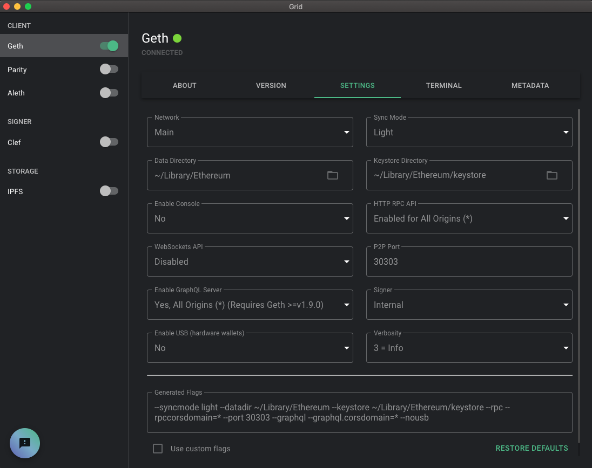
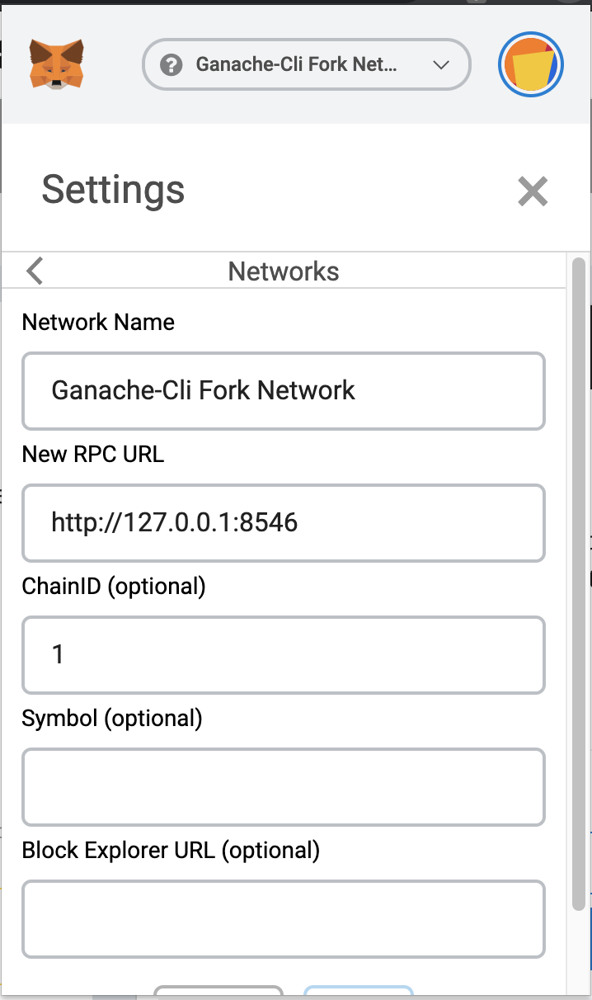

# Flashloan Arbitrage Trading
### What is this?
In De-Fi world, arbitrage is a common topic among crypto traders as there are more and more Dexs coming into the market. Recently, I got a chance to get involved in Aave's official chat, and got interested in Flashloan. In arbitrage trading, the first pain point is how the arbitrageuer provides capital for the tiny change of arbitrage. With Flashloan, literally, there is no limit of providing capital. 
So, as part of my Ethereum Dapp study, I built a Flashloan based arbitrage bot that is monitoring Kyber and Uniswap, then executes Flashloan and trading ETH(DAI or SAI) between Kyber and uniswap.

### Table of Contents
- [Token Flow](#token-flow)
- [Protocols and Tech](#protocols-and-tech)
- [Installation](#installation)
- [Executing Trade](#executing-trade)
- [Note on Protocols](#note-on-protocols)
- [Reducing Gas and fee Spending](#reducing-gas-and-fee-spending)
- [Monitoring Arbitrage](#monitoring-arbitrage)
- [Todo](#todo)
- [Inspirations and Helpful Links](#inspirations-and-helpful-links)

---

## Protocols and Tech
- Flashloan: [Aave Protocal](https://docs.aave.com/developers/)
- Dex for buying token: [Kyber Network](https://developer.kyber.network/)
- Dex for selling token: [Uniswap V1](https://uniswap.org/docs)
- Backbone of app: [node](https://nodejs.org/en/)
- Solidity Smart Contract management debug: [Truffle Suite](https://www.trufflesuite.com/)
- Node forking: [Ganache-cli](https://www.trufflesuite.com/docs/ganache/quickstart)
- Node management: [Grid + Geth](https://github.com/ethereum/grid)
- Node for exchange rate monitoring: [Infura](https://infura.io/)
- Personal wallet for test: [Metamask](https://metamask.io/)
---

## Installation

### 1. Check out repo & install packages
```sh
$git clone https://github.com/cryptopixelfrog/ArbSlippageTrading.git
$npm install
```
### 2. Prepare Ethereum node
I am using Grid for this project, and this is my first time to use Grid and Geth. I tried to look for some instructions of usage, but it was not easy. So here I add some of my notes.

#### Install and set Grid
- [Grid](https://github.com/ethereum/grid), is Ethereum node management tool. With Grid, you can simply run Geth, Parity, Aleth, Clef and even IPFS.

#### Download and Config Geth in Grid
- You can download the most up to date Geth and install it under Grid.
- Config Geth

    - Selecting Light Sync Mode may be a good idea to save storage space on your work computer. I do use Light, but it still takes about 13GB of my storage.
    - Select Enabled for All Origins for HTTP RPC API, so we can fork the node via ganache-cli.
    - Select "Yes, All Origins (*)" for Enable GraphQL Server, so we can use Grid's GraphQL tool to check details of data in blockchain.
- Start your node and wait until full sync of node, and wait peers.

### 3. Fork node via ganache-cli
Default
```sh
ganache-cli --fork http://localhost:8545
```
Final
```sh
$ ganache-cli --fork http://localhost:8545 --unlock 0x6b175474e89094c44da98b954eedeac495271d0f --unlock 0x89d24A6b4CcB1B6fAA2625fE562bDD9a23260359 -i 1 -d
```

This is basically what you will need to execute to fork your node as a starting point. Later on, to mint DAI or SAI, we need to add some more options in the cml. Please check below. 

- Unlocking necessary contract address
For Flashloan of DAI(Aave let you Flashloan DAI too), you need DAI in your Smart Contract(AKA: receiver Smart Contract). You can have real DAI in your wallet before you forking the local node, and send it to your Flashloan receiver Smart Contract after truffle compilation. OR, you can simply mint the DAI all by yourself. 
To mint the DAI, you need to unlock the asset Smart Contrat on your forked node, so you can access it's owner only APIs. You can unlock any address with ganache-cli's --unlock option. '0x6b175474e89094c44da98b954eedeac495271d0f' is DAI address, and '0x89d24A6b4CcB1B6fAA2625fE562bDD9a23260359' is SAI address.
    ```sh
    $ ganache-cli --fork http://localhost:8545 --unlock 0x6b175474e89094c44da98b954eedeac495271d0f --unlock 0x89d24A6b4CcB1B6fAA2625fE562bDD9a23260359
    ```
- Assigning chainId
Assigning chainId "1" on a fork will prevent failure of sending transactions.
I had below error msg in my transaction on forked node. I had set chainId(networkId) in my transaction object as 1, but still had the same failure. 
    ```sh
    sendSignedTransaction error Error: Returned error: Missing required chain parameter: networkId
    ```
    Assigning chainId in fork cml like:
    ```sh
    -i 1
    ```
    resolved the issue. In the beginning, I thought once I fork the node, the chainId is being 1 as default, but I think I am wrong. Or maybe, I have set the chainId in my metamask(wallet)'s Custom RPC as 1, and this may be related with tx, and caused the above error. Anyway, passing chainId in cml and following my instruction will make you bypass the failure.

- Setting dedicated accounts
--- This is optional, but I realized that having the same ganache accounts everytime when I fork the node is easy for me to manage my test. Just adding "-d" option to have dedicated accounts.

### 4. Connect Metamask with forked node via Custom RPC


### 5. Set truffle-config.js
Don't confuse the port number. 8546 is what the forked node is listening, and 8545 is where the forked node is located. Metamask Custom RPC and nodejs app setting is 8546!
```javascript
    development: {
      host: "127.0.0.1",
      port: 8546, // forked Geth node is listening port 8546. 8545 is location of forked node
      gas: 20000000,
      network_id: "*", //config to '*' to match any id provided by ganache
      skipDryRun: true
    },
```

### 6. Setting Infura for Exchange Rate Monitoring
This app is an arbitrage trading app. Executing trade is the main purpose of Smart Contract, but getting a chance of arbitrage between two Dex is a gateway of trading. So, setting and running an exchange rate monitoring script is necessary. We can run the monitoring script against the forked node since it is forked from the main net. 
However, I personally created an Infura account and used it as a web3 http provider. In short, the trading will use the forked node since it is with Solidiy & Ethereum blockchain, but the monitoring script will use Infura, so it sees real time rate changes between Kyber and Uniswap.

### 7. Compile and Migrate Contracts
```sh
$ truffle compile
$ truffle migrate --reset
```

### 8. Send ETH to wallet and contracts
Once compilation and migration are compiled without failure, you need to send some ETH to #1 unlock the DAI and SAI contract(to mint DAI and SAI) and #2 Flashloan receiver Smart Contract(to pay Flashloan fee).

### 9. Mint DAI or SAI
<i>This is only for flashloan DAI from Aave.</i>
As a default, this app does Flashloan ETH from Aave, but you can Flashloan DAI or SAI too by changing loan asset address in Smart Contract. For ETH Flashlona, you don't need this step, but if you will Flashloan DAI or SAI, then you need this step.

---

## Executing Trade
Executing trade is also involving catching arbitrage between Dexs. There are a bunch of standalone JS scripts that we can execute via terminal to monitor arbitrage, however still executing trade part is not integrated. Still you can test trade via the trading script though.  

### Pre-requirement
Catching ETH<->DAI price arbitrage is what needs to be done before executing trade.

### Integration of trading call
As soon as there is a chance of arbitrage, the Trading function needs to be called, for that, this script needs to be integrated in the exchange rate monitoring script.

---

## Token Flow
As a beginner of Ethereum Dapp development, visibility of token flow is one of the big questions. Here, I add the TX receipt that I got. The logIndex and address will give an idea about flow of the ETH and DAI. 

### In difficult way ;), check Receipt output
```sh
    {
      logIndex: 1,
      transactionIndex: 0,
      transactionHash: '0x2fdec45c67be3f3b028b9acd07889a42addbea04cadadd10e7786b7a3ea936c4',
      blockHash: '0x6f08b8a6b25d7ee6fc724d788bbd2e96671f2dc71656f55f122a26a71fc2a97d',
      blockNumber: 9872599,
      address: '0x6B175474E89094C44Da98b954EedeAC495271d0F',
      data: '0x0000000000000000000000000000000000000000000000087fb73493213e0c07',
      topics: [Array],
      type: 'mined',
      id: 'log_432fd7b7'
    },
    {
      logIndex: 2,
      transactionIndex: 0,
      transactionHash: '0x2fdec45c67be3f3b028b9acd07889a42addbea04cadadd10e7786b7a3ea936c4',
      blockHash: '0x6f08b8a6b25d7ee6fc724d788bbd2e96671f2dc71656f55f122a26a71fc2a97d',
      blockNumber: 9872599,
      address: '0x2a1530C4C41db0B0b2bB646CB5Eb1A67b7158667',
      data: '0x',
      topics: [Array],
      type: 'mined',
      id: 'log_dc4fd51a'
    },
    {
      logIndex: 3,
      transactionIndex: 0,
      transactionHash: '0x2fdec45c67be3f3b028b9acd07889a42addbea04cadadd10e7786b7a3ea936c4',
      blockHash: '0x6f08b8a6b25d7ee6fc724d788bbd2e96671f2dc71656f55f122a26a71fc2a97d',
      blockNumber: 9872599,
      address: '0x6B175474E89094C44Da98b954EedeAC495271d0F',
      data: '0x0000000000000000000000000000000000000000000000087fb73493213e0c06',
      topics: [Array],
      type: 'mined',
      id: 'log_0b66c20c'
    },
    {
      logIndex: 4,
      transactionIndex: 0,
      transactionHash: '0x2fdec45c67be3f3b028b9acd07889a42addbea04cadadd10e7786b7a3ea936c4',
      blockHash: '0x6f08b8a6b25d7ee6fc724d788bbd2e96671f2dc71656f55f122a26a71fc2a97d',
      blockNumber: 9872599,
      address: '0x31E085Afd48a1d6e51Cc193153d625e8f0514C7F',
      data: '0x000000000000000000000000eeeeeeeeeeeeeeeeeeeeeeeeeeeeeeeeeeeeeeee0000000000000000000000000000000000000000000000000de0b6b3a76400000000000000000000000000006b175474e89094c44da98b954eedeac495271d0f0000000000000000000000000000000000000000000000087fb73493213e0c0600000000000000000000000065bf64ff5f51272f729bdcd7acfb00677ced86cd0000000000000000000000000000000000000000000000000000000000000000',
      topics: [Array],
      type: 'mined',
      id: 'log_fa771842'
    },
    {
      logIndex: 5,
      transactionIndex: 0,
      transactionHash: '0x2fdec45c67be3f3b028b9acd07889a42addbea04cadadd10e7786b7a3ea936c4',
      blockHash: '0x6f08b8a6b25d7ee6fc724d788bbd2e96671f2dc71656f55f122a26a71fc2a97d',
      blockNumber: 9872599,
      address: '0x6B175474E89094C44Da98b954EedeAC495271d0F',
      data: '0x0000000000000000000000000000000000000000000000087fb73493213e0c06',
      topics: [Array],
      type: 'mined',
      id: 'log_4a3336cf'
    },
    {
      logIndex: 6,
      transactionIndex: 0,
      transactionHash: '0x2fdec45c67be3f3b028b9acd07889a42addbea04cadadd10e7786b7a3ea936c4',
      blockHash: '0x6f08b8a6b25d7ee6fc724d788bbd2e96671f2dc71656f55f122a26a71fc2a97d',
      blockNumber: 9872599,
      address: '0x65bF64Ff5f51272f729BDcD7AcFB00677ced86Cd',
      data: '0x000000000000000000000000eeeeeeeeeeeeeeeeeeeeeeeeeeeeeeeeeeeeeeee0000000000000000000000006b175474e89094c44da98b954eedeac495271d0f0000000000000000000000000000000000000000000000000de0b6b3a76400000000000000000000000000000000000000000000000000087fb73493213e0c06000000000000000000000000b6800d466876643cf9ef89ffd42ad4a7deb434bd0000000000000000000000000000000000000000000000000de0b6b3a7640000000000000000000000000000000000000000000000000000000000000000000000000000000000000000000031e085afd48a1d6e51cc193153d625e8f0514c7f00000000000000000000000000000000000000000000000000000000000001200000000000000000000000000000000000000000000000000000000000000000',
      topics: [Array],
      type: 'mined',
      id: 'log_f0ff97ae'
    },
    {
      logIndex: 7,
      transactionIndex: 0,
      transactionHash: '0x2fdec45c67be3f3b028b9acd07889a42addbea04cadadd10e7786b7a3ea936c4',
      blockHash: '0x6f08b8a6b25d7ee6fc724d788bbd2e96671f2dc71656f55f122a26a71fc2a97d',
      blockNumber: 9872599,
      address: '0x818E6FECD516Ecc3849DAf6845e3EC868087B755',
      data: '0x000000000000000000000000eeeeeeeeeeeeeeeeeeeeeeeeeeeeeeeeeeeeeeee0000000000000000000000006b175474e89094c44da98b954eedeac495271d0f0000000000000000000000000000000000000000000000000de0b6b3a76400000000000000000000000000000000000000000000000000087fb73493213e0c06',
      topics: [Array],
      type: 'mined',
      id: 'log_91548280'
    },
    {
      logIndex: 8,
      transactionIndex: 0,
      transactionHash: '0x2fdec45c67be3f3b028b9acd07889a42addbea04cadadd10e7786b7a3ea936c4',
      blockHash: '0x6f08b8a6b25d7ee6fc724d788bbd2e96671f2dc71656f55f122a26a71fc2a97d',
      blockNumber: 9872599,
      address: '0xb6800D466876643cF9Ef89Ffd42Ad4A7DEb434bD',
      data: '0x000000000000000000000000398ec7346dcd622edc5ae82352f02be94c62d1190000000000000000000000000000000000000000000000000de0b6b3a76400000000000000000000000000000000000000000000000000087fb73493213e0c06',
      topics: [Array],
      type: 'mined',
      id: 'log_486c6963'
    },
    {
      logIndex: 9,
      transactionIndex: 0,
      transactionHash: '0x2fdec45c67be3f3b028b9acd07889a42addbea04cadadd10e7786b7a3ea936c4',
      blockHash: '0x6f08b8a6b25d7ee6fc724d788bbd2e96671f2dc71656f55f122a26a71fc2a97d',
      blockNumber: 9872599,
      address: '0x6B175474E89094C44Da98b954EedeAC495271d0F',
      data: '0x0000000000000000000000000000000000000000000000087fb73493213e0c06',
      topics: [Array],
      type: 'mined',
      id: 'log_d9ec44f8'
    },
    {
      logIndex: 10,
      transactionIndex: 0,
      transactionHash: '0x2fdec45c67be3f3b028b9acd07889a42addbea04cadadd10e7786b7a3ea936c4',
      blockHash: '0x6f08b8a6b25d7ee6fc724d788bbd2e96671f2dc71656f55f122a26a71fc2a97d',
      blockNumber: 9872599,
      address: '0x6B175474E89094C44Da98b954EedeAC495271d0F',
      data: '0x0000000000000000000000000000000000000000000000087fb73493213e0c06',
      topics: [Array],
      type: 'mined',
      id: 'log_5b78fcdb'
    },
    {
      logIndex: 11,
      transactionIndex: 0,
      transactionHash: '0x2fdec45c67be3f3b028b9acd07889a42addbea04cadadd10e7786b7a3ea936c4',
      blockHash: '0x6f08b8a6b25d7ee6fc724d788bbd2e96671f2dc71656f55f122a26a71fc2a97d',
      blockNumber: 9872599,
      address: '0x2a1530C4C41db0B0b2bB646CB5Eb1A67b7158667',
      data: '0x',
      topics: [Array],
      type: 'mined',
      id: 'log_4508b3dc'
    },
    {
      logIndex: 12,
      transactionIndex: 0,
      transactionHash: '0x2fdec45c67be3f3b028b9acd07889a42addbea04cadadd10e7786b7a3ea936c4',
      blockHash: '0x6f08b8a6b25d7ee6fc724d788bbd2e96671f2dc71656f55f122a26a71fc2a97d',
      blockNumber: 9872599,
      address: '0xb6800D466876643cF9Ef89Ffd42Ad4A7DEb434bD',
      data: '0x000000000000000000000000398ec7346dcd622edc5ae82352f02be94c62d1190000000000000000000000000000000000000000000000000de0b6b3a76400000000000000000000000000000000000000000000000000000001c6bf526340000000000000000000000000000000000000000000000000000dcb6e333a570b73',
      topics: [Array],
      type: 'mined',
      id: 'log_aacac465'
    },
    {
      logIndex: 13,
      transactionIndex: 0,
      transactionHash: '0x2fdec45c67be3f3b028b9acd07889a42addbea04cadadd10e7786b7a3ea936c4',
      blockHash: '0x6f08b8a6b25d7ee6fc724d788bbd2e96671f2dc71656f55f122a26a71fc2a97d',
      blockNumber: 9872599,
      address: '0xb6800D466876643cF9Ef89Ffd42Ad4A7DEb434bD',
      data: '0x000000000000000000000000398ec7346dcd622edc5ae82352f02be94c62d11900000000000000000000000000000000000000000000000107aa5cc9d81fc000',
      topics: [Array],
      type: 'mined',
      id: 'log_9214e733'
    },
    {
      logIndex: 14,
      transactionIndex: 0,
      transactionHash: '0x2fdec45c67be3f3b028b9acd07889a42addbea04cadadd10e7786b7a3ea936c4',
      blockHash: '0x6f08b8a6b25d7ee6fc724d788bbd2e96671f2dc71656f55f122a26a71fc2a97d',
      blockNumber: 9872599,
      address: '0xb6800D466876643cF9Ef89Ffd42Ad4A7DEb434bD',
      data: '0x000000000000000000000000b6800d466876643cf9ef89ffd42ad4a7deb434bd0000000000000000000000000000000000000000000000001bac24e6e1bb0b73',
      topics: [Array],
      type: 'mined',
      id: 'log_2e0408e8'
    },
    {
      logIndex: 15,
      transactionIndex: 0,
      transactionHash: '0x2fdec45c67be3f3b028b9acd07889a42addbea04cadadd10e7786b7a3ea936c4',
      blockHash: '0x6f08b8a6b25d7ee6fc724d788bbd2e96671f2dc71656f55f122a26a71fc2a97d',
      blockNumber: 9872599,
      address: '0x3dfd23A6c5E8BbcFc9581d2E864a68feb6a076d3',
      data: '0x0000000000000000000000000000000000000000000028eba89ba8e704a389b00000000000000000000000000000000000000000001c9e1b0ae43d1a253bdf19000000000000000000000000000000000000000000030aafd3b9c7676c2fe5ae0000000000000000000000000000000000000000033bc9a0782653b87466e7830000000000000000000000000000000000000000033cd8395db9529323075ea4',
      topics: [Array],
      type: 'mined',
      id: 'log_330ca5f4'
    },
    {
      logIndex: 16,
      transactionIndex: 0,
      transactionHash: '0x2fdec45c67be3f3b028b9acd07889a42addbea04cadadd10e7786b7a3ea936c4',
      blockHash: '0x6f08b8a6b25d7ee6fc724d788bbd2e96671f2dc71656f55f122a26a71fc2a97d',
      blockNumber: 9872599,
      address: '0x398eC7346DcD622eDc5ae82352F02bE94C62d119',
      data: '0x0000000000000000000000000000000000000000000000000de0b6b3a76400000000000000000000000000000000000000000000000000000003328b944c40000000000000000000000000000000000000000000000000000000f5904616e000000000000000000000000000000000000000000000000000000000005e96153e',
      topics: [Array],
      type: 'mined',
      id: 'log_73821d58'
    }
  ],
  status: true,
  logsBloom: '0x000000800040000000000020004000002080808200004200004000000000000002008000000000000c00000004000084100000008100000000100000a02000000040000084000000400400080000000002404204000000000000000000000000300000000000000000000000000800000400000000000000000000100000000100000040000000001020000100000000008600000140000000000010080000000201202000040000000000000040100000000004000c0000000000200000000000100002010808000019200004108000000002000000000000000010000010000010064000000008041000000000220000040000000000000000000000100800'
}
```

### Simpler way
```sh
logIndex: 0 - 0xb6800D466876643cF9Ef89Ffd42Ad4A7DEb434bD - Receiver Contract
logIndex: 1 - 0x6B175474E89094C44Da98b954EedeAC495271d0F - DAI asset
logIndex: 2 - 0x2a1530C4C41db0B0b2bB646CB5Eb1A67b7158667 - uniswap DAI exchange
logIndex: 3 - 0x6B175474E89094C44Da98b954EedeAC495271d0F - DAI asset
logIndex: 4 - 0x31E085Afd48a1d6e51Cc193153d625e8f0514C7F - Kyber Reserve
logIndex: 5 - 0x6B175474E89094C44Da98b954EedeAC495271d0F - DAI asset
logIndex: 6 - 0x65bF64Ff5f51272f729BDcD7AcFB00677ced86Cd - Kyber Contract 2
logIndex: 7 - 0x818E6FECD516Ecc3849DAf6845e3EC868087B755 - Kyber Proxy
logIndex: 8 - 0xb6800D466876643cF9Ef89Ffd42Ad4A7DEb434bD - Receiver Contract
logIndex: 9 - 0x6B175474E89094C44Da98b954EedeAC495271d0F - DAI asset
logIndex: 10 - 0x6B175474E89094C44Da98b954EedeAC495271d0F - DAI asset
logIndex: 11 - 0x2a1530C4C41db0B0b2bB646CB5Eb1A67b7158667 - Uniswap
logIndex: 12 - 0xb6800D466876643cF9Ef89Ffd42Ad4A7DEb434bD - Receiver Contract
logIndex: 13 - 0xb6800D466876643cF9Ef89Ffd42Ad4A7DEb434bD - Receiver Contract
logIndex: 14 - 0xb6800D466876643cF9Ef89Ffd42Ad4A7DEb434bD - Receiver Contract
logIndex: 15 - 0x3dfd23A6c5E8BbcFc9581d2E864a68feb6a076d3 - Aave Lending Pool Core
logIndex: 16 - 0x398eC7346DcD622eDc5ae82352F02bE94C62d119 - Aave Lending Pool
```

### TL;DR
- ETH from Aave Flashloan
- ETH, in my receiver Smart Contract
- ETH to DAI trading on Kyber
- DAI, in my receiver Smart Contract
- DAI to ETH trading on Uniswap
- ETH, in my receiver Smart Contract
- ETH, payback to Aave
---

## Note on Protocols

### Aave
At first, for arbitrage trading, this app flashloan it's capital from Aave. This is the call that executes Flashloan, and gets the ETH from Aave's asset pool. You can actually include the Flashloan call in your receiver Smart Contract, but I directly initialized Aave's LendingPool Smart Contract in JS script, and executed the Flashloan call on the same JS script. Important thing is that the parameters - receiverContract, reserveAddrETH, flashloanAmount are needed to set properly. receiverContract is a Smart Contract that receives loan, and executes the trading. reserveAddrETH is ETH address(0xEeeeeEeeeEeEeeEeEeEeeEEEeeeeEeeeeeeeEEeE), and flashloanAmount is the amount of token that you need as capital. 
```javascript
  const tx =  LendingPoolInst.methods.flashLoan(receiverContract, reserveAddrETH, flashloanAmount, byteMemoryData);
```

### Kyber
This app is using Kyber's [swapEtherToToken()](https://developer.kyber.network/docs/API_ABI-KyberNetworkProxy/#swapethertotoken) to swap Flashloaned ETH to DAI. 
```javascript
uint256 token_bought = kyberExchange.swapEtherToToken.value(_ethToSell)(token, _expectedRate);
```

### Uniswap
This app is using Uniswap's [tokenToEthTransferInput()](https://uniswap.org/docs/v1/smart-contracts/exchange/#tokentoethtransferinput) to swap DAI to ETH back. tokenToEthTransferInput is for when you want to swap an exact amount of tokens for as much ETH as possible, and send that to an address of your choosing. In Uniswap, there is a similar but different purpose of API - tokenToEthTransferOutput(), this is for when you want to swap as few tokens as possible for an exact amount of ETH, and send that to an address of your choosing. 
```javascript
uint256 tokens_sold = uniSwapExchange.tokenToEthTransferInput(token_bought, _maxTokensSell, _sellDeadline, address(this));
```

---

## Reducing Gas and fee Spending
Arbitrage trading looks for a short(?) chance of profit. Reducing additional resource(human efforts, capital and time) spending is important than writing better looking code. I personally think reducing resources is still an assignment for me, so I would love to share more detail for someone like me(who just started development of dapp).
Below are what take most of my own fund, and those include Gas to execute Smart Contract and fees from third party Protocols.

### Trading fee on Protocols
- Aave Flashloan - [0.09% fee](https://medium.com/aave/flash-loans-one-month-in-73bde954a239)
(10 eth -> 0.009 eth)
- Kyber - [feeless for Maker/Taker/Withdraw](https://medium.com/kyberswap/3-things-you-probably-missed-about-kyberswap-limit-orders-bfb49c2969d8)(not for limit order), No withdrawal fee, only gas needed.
(10 eth -> 0 eth)
https://www.blockfer.com/exchanges/reviews/uniswap/
- Uniswap -[0.3% of Maker and Taker fee, No withdrawal fee](https://uniswap.org/docs/v1/), No withdrawal fee, only gas needed.
(10 eth -> 0.03 eth)
https://www.blockfer.com/exchanges/reviews/uniswap/

    **Total fee estimate: 0.039 eth**

### Most Gas usages in Smart Contract

#### 1. Fixed array for dynamic parameters
```sh
uint256[] myArray = new uint256[](3);
function getArray() internal view return(uint256[] memory) {
    return myArray;
}
function setArray(uint256 minConversionRate_a, uint256 maxTokenSell_a, uint256 sellDeadline_a) public {
    myArray = [minConversionRate_a, maxTokenSell_a, sellDeadline_a];
}
uint256 memory param = getArray();
...
uint256[] myArray = new uint256[](3);
```

#### 2. Two Kyber calls, and one Uniswap call
```javascript
(uint _expectedRate, uint _slippageRate) = kyberExchange.getExpectedRate(ERC20(0xEeeeeEeeeEeEeeEeEeEeeEEEeeeeEeeeeeeeEEeE),token,_ethToSell);
uint256 token_bought = kyberExchange.swapEtherToToken.value(_ethToSell)(token, _expectedRate);
...
uniSwapExchange.tokenToEthTransferInput(token_bought, _maxTokensSell, _sellDeadline, address(this));
```

#### 3. Aave Flashloan flow
- Execute Flashlaon -> Aave Lending Pool -> Execute callback(executeOperation) -> Execute trade on receiver contract.

---

## Estimate of fund spending
To estimate my own fund spending. I have performed testing on entire trading process - Flashloan(10 ETH) -> Kyber(ETH->DAI) -> Uniswap(DAI->ETH) -> Paying back Flashloan(10 ETH).

| # | morning - 04.19.2020 | night - 04.19.2020 | morning - 04.20.2020 | night - 04.20.2020 | 
| ------ | ------ | ------ | ------ | ------ |
| 1 | 0.076598591101090943 | 0.078802432958387935 | 0.084278335131889377 | 0.075114023827822051 | 
| 2 | 0.077987656645443088 | 0.078672043062621298 | 0.078754280798281366 | 0.075271113928774788 | 
| 3 | 0.07797187675416624 | 0.077843983166853987 | 0.077921560899763722 | 0.075258134029726882 | 
| 4 | 0.077975616862888674 | 0.076213173479548005 | 0.07791782100124543 | 0.075262624130678333 | 
| 5 | 0.077971496971610389 | 0.076396303583777995 | 0.077926981102726489 | 0.07525459423162914 | 
| 6 | 0.077967487080331386 | 0.076387793688007311 | 0.077834571204206901 | 0.075258044332579305 | 
| 7 | 0.077971497189051663 | 0.076387893792235952 | 0.077939121305686664 | 0.074852094433528827 | 

Gas and fees are being charged from both my wallet and receiver Smart Contract. This is important to calculate all the spendings. To get above data, I checked the starting balance of ETH on both my wallet and receiver Smart Contract, and subtracted the ending balance of ETH. 
Average spending for 10 ETH($1885.60) trading is 0.078 ETH($14.71). 
It is 0.0078 ETH($1.47) per 1 ETH($188.56) trading.
What this telling is the minimum arbitrage between two Dexs for ETH -> DAI VS DAI -> ETH has to be greater than 0.0078 ETH.

---

## Monitoring Arbitrage
I have run the arbitrage monitoring script for about two weeks, and randomly got some outputs. Here I add part of the output that I got on 04.18.2020.
```javascript
180.60060339541924 : 180.55716454974875
 profit: 0.000240569636719405
<< Got Arbitrage >>
4/18/2020, 8:19:38 AM

180.60060339541924 : 180.5535826806523
 profit: 0.0002173379908166
<< Got Arbitrage >>
4/18/2020, 8:20:38 AM

184.59914073996725 : 184.1324283141922
 profit: 0.002534519216056559
<< Got Arbitrage >>
4/18/2020, 7:12:34 PM

184.5180681953067 : 184.4652578373181
 profit: 0.000286273445709606
<< Got Arbitrage >>
4/18/2020, 8:03:28 PM

183.14833838142354 : 183.00635125235175
 profit: 0.000775817255099999
<< Got Arbitrage >>
4/18/2020, 8:12:13 PM
```
Do you see the "profit" at 7:12:34 PM? It is 0.002534519216056559 ETH per 1 ETH. This was the most profitable number that I got during 18th. This is a profit that I can make when I buy DAI with 1 ETH on Kyber, then sell the DAI on Uniswap for ETH.
Unfortunately, this is way less than what I need to spend to trade 1 ETH - 0.0078 ETH.

---

### Is this live?
No. I did not deploy my app to the main net. It is because I still do not have solid confidence that there will be profitable arbitrage(> 0.0078 ETH / 1 Eth) between Kyber and Uniswap. All depends on when I can get the profitable arbitrage. So, please use this as an education purpose.

---

## Todo
- More optimization of Smart Contract for less gas usage (this is important for actual profit, less gas means more profit)
- Faster Trading execution script(currently nodejs script is being used, but maybe C++ or Java are better)
- Better Uniswap exchange logic(Uniswap has token )
---

## Inspirations and Helpful Links
- [ez-flashloan](https://github.com/mrdavey/ez-flashloan)
- [orfeed](https://github.com/ProofSuite/OrFeed)
- [aaveFlashLoan](https://github.com/johngrantuk/aaveFlashLoan)
- [WEI to ETHER](https://eth-converter.com/)
- [Optimizing SC for less gas spending](https://medium.com/better-programming/how-to-write-smart-contracts-that-optimize-gas-spent-on-ethereum-30b5e9c5db85)
- [Exchange App With Uniswap](https://medium.com/icovo/build-an-eth-erc20-tokens-exchange-app-with-uniswap-a09a34cfee9b)
- [Compound Liquidation Bot](https://blog.baowebdev.com/2019/11/how-to-build-a-compound-liquidation-bot/)


